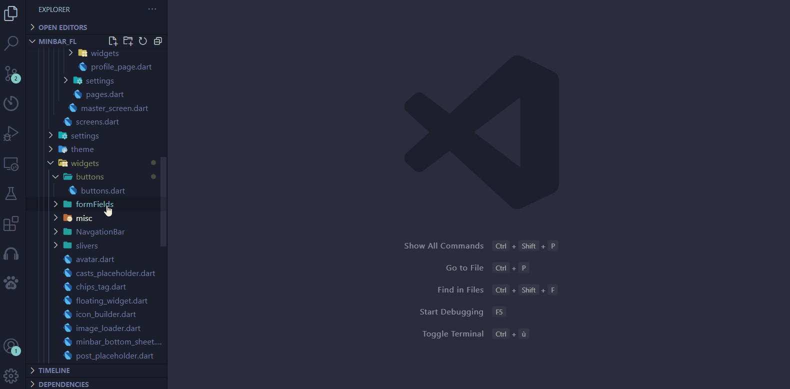

# Components boilerplate


### Components boilerplate is a Vscode Plugin that generate code/files from a predefined configuration file "template".


This plugin tend to increase productivity and help maintain the same files structure across different developers/project.
## Guide of usage
Components boilerplate generates files/folders/code from a giving configuration file.
### Creating config file:
To be able to generate components you have to create a boilerplate config file with the necessary boilerplate template.
* A valid config file must be in your workspace project directory under the name of `boilerplates.config.js` in order for the plugin to work.
 >[the reason for using `js` file format](#why-js-instead-of-json)
### config structure:
the config file is a javascript file which a single variable with no definition is an array []  `BoilerplateConfig[]`.
##### **Type definition:**
```ts
interface BoilerplateConfig {
  name: string;
  variants: string[];
  template:[string,string][];
}
```


##### **Details:**

| proprieties | definition |
| -----| ------ | 
|``name : string``|Name of the boilerplate,In case you have more then on element in the config array you will be asked to select a boilerplate template by name|
|``variants : string[]``|array of string will be used later to fill the boilerplate code|
|``template:[path,content][]``|an array of doubles contains the path and content of the file that will be generated|


```js
[
  { name:"name",
    variants:["variant1","variant2",...],
    template:[
      ["path","content"],
      ...
      ]
    },
    ...
  ]
```

 
### How to use variants:
variants are a placeholders to variables,You will be asked to provide a value for each variant when generating a component.
Any string that wrapped in double brackets and have a value that exists in variants array will be replaced by the value provided when generating the component. 
eg:


```js
[
  { name:"template_name",
    variants:["name","variant","variant1"],
    template:[
      [`index.js`,
       `import {{variant}} from "{{variant1}}.js"`
      ],
      [`{{variant1}}.js`,
       `export default {{variant}}="hello world";`
      ]
    ]
  },
  { name:"SimpleFile",
    variants:["variant1","variant2","variant3"],
    template:[
      ["boilerplate/{{variant1}}.txt",
      `{{variant1}}+{{variant2}}={{variant3}}`],
      
      ]
    }
]
```
> eg:`{{variant}}` will be replaced to a value giving by the user when generating the component. 


#### Naming Conventions:
we've added a new feature that allow you to convert the value of variants before replacing them in template into different case styles.
by providing a `suffix` after the first closing brackets `{{variant}suffix}` with one of the following values the variant placeholder will be replaced by the selected case.


|Suffix|Case Style|Definition
|------|------|-----|
|``empty``|`default`|Suffix is optional, If there is no suffix the value will stay the same.
|``cc``|`camelCase`|the value will be converted to [camelCase](https://en.wikipedia.org/wiki/Camel_case),eg:`hello word`=>`helloWorld`.
|``sc``|`snake_case`|the value will be converted to [snake_case](https://en.wikipedia.org/wiki/Snake_case),eg:`helloWorld`=>`hello_world`.
|``pc``|`PascalCase`|the value will be converted to [PascalCase](https://en.wikipedia.org/wiki/Pascal_case),eg:`hello_world`=>`HelloWorld`.
|``kc``|`kebab-case`|the value will be converted to [kebab-case](https://en.wikipedia.org/wiki/kebab_case),eg:`HelloWorld`=>`hello-world`.

* This extension is not very smart so values need to be written in a correct language or a valid [case styles](https://en.wikipedia.org/wiki/Naming_convention_(programming)) to get a correct conversion.

#### ***eg***:
we somewhere in template:
`{{variant}sc}` => value will be convert to snake_case.

`hello world` || `HelloWorld`...ext =>  `hello_world` as intended.

`hellowoRld` =>  `Hellowo_rld`. which is not what we want propably.

### Plugin options:
|Option|Value|Definition
|------|------|-----|
|``isWrapped``(***deprecated***)|`Default:disabled`|When enabled first variant will be used as a wrapper directory for the generated component
>***warning***: ``isWrapped`` is deprecated as there is no need for it anymore, the only reason for keeping it is to keep the support for older config files. 


## Generate components:
- Right click on the intended folder
- click on `Generate new component...`
- Fill the necessary data.
- Done!
  

### example:

#### ***flutter widget example:***

`boilerplates.config.js`:

```js

[
  {name:"flutter-Stateless",variants:["widgetName"],template:[
    [
      '{{widgetName}sc}.dart',
`import 'package:flutter/material.dart';

class {{widgetName}pc} extends StatelessWidget {
  const {{widgetName}pc}({Key? key}) : super(key: key);
      
  @override
  Widget build(BuildContext context) {
    return Container();
  }
}
    `,
    ]
  ]
  }
  ,{name:"flutter-statful",variants:["widgetName"],template:[
    [
'{{widgetName}sc}.dart',
`import 'package:flutter/material.dart';

class {{widgetName}pc} extends StatefulWidget {
  {{widgetName}pc}({Key? key}) : super(key: key);

  @override
  _{{widgetName}pc}State createState() => _{{widgetName}pc}State();
}

class _{{widgetName}pc}State extends State<{{widgetName}pc}> {
  @override
  Widget build(BuildContext context) {
    return Container();
  }
}
    `,
    ]
  ]
  }

];
```
  


#### ***generate react typescript component :***


`boilerplates.config.js`:
```js
[
  {name:"react",variants:["componentName"],template:[
    [
      '{{componentName}sc}/{{componentName}pc}.tsx',
`import React from 'react';
import '.style/index.scss';
interface I{{componentName}pc} {
}

function {{componentName}pc}({}: I{{componentName}pc}) {
  return (
    <div className="{{componentName}kc}"></div>
  );
}
    
export default {{componentName}pc};

`,
    ],
    [
      '{{componentName}sc}/index.ts',
`import {{componentName}pc} from './{{componentName}pc}';
export default {{componentName}pc};`,
    ],
    [
      '{{componentName}sc}/style/index.scss',
      `.{{componentName}kc}{
}`,
    ],
    ["{{componentName}sc}/{{componentName}pc}.stories.tsx",
    `import React, { ComponentProps } from 'react';
import type { Story } from '@storybook/react';
import  {{componentName}pc}  from './{{componentName}pc}';
//👇 This default export determines where your story goes in the story list
export default {
  title: '{{componentName}pc}',
  component: {{componentName}pc},
};
const Template: Story<ComponentProps<typeof {{componentName}pc}>> = (args) => <{{componentName}pc} {...args} />;
export const FirstStory = Template.bind({});
FirstStory.args = {
};`
  ]
  ]
  }
];
```
[More examples](https://github.com/Danzo7/vscode-components-boilerplate/tree/master/examples).

## FAQ 
#### **Why `js` instead of `json` file format**:

In `Json` the only way to have newLine characters is to add `\n` character as json does not support new line character, That means if you type the enter key it it will be an invalid `Json` file.

having `\n` after each new line and wrap all lines in a single string is not very readable.

Although its the most used format data it was not possible to use it in this case.

We end up choosing `js` as its the mother of `json`. 
the main reason for choosing js is because its have  called [Template literals (Template strings)](https://developer.mozilla.org/en-US/docs/Web/JavaScript/Reference/Template_literals).

Using template strings (```backticks(`)``` instead of `quotes("|')`) allow to have newLine characters which make the config file more readable and easy to configure.
it was also possible to keep a json like highliting by using `js` too.

***how its work?***
 >`js` execute code line by line and allow to have an expression without an assignment.
 
 1. make sure that the config object (which is an array of template) is declared as an expression and not an assignment.
 2. check if the file is valid and then run it.
 3. after running the file, simply assign the object and use it.


## Whats next?
At this point the plugin has reach its goal, The one that I really need it to be for, a tool to help me organize my project structure and to be able to keep the same structure with all my dev friends and what a satisfaction when its reached a point when I can say "I did it".
Some says that files structure is small part of the project and you shouldn't [overthink](https://reactjs.org/docs/faq-structure.html#dont-overthink-it) on that, I don't take that advice and here we are, But even though it takes me some time to realize that it was a mistake, I enjoy the idea that could be someone out there who will find this helpful, I may not get a trophy or a complement for the work but I will consider this as an achievement some thing that "I did".
At the end I have to say thank you to you who's reading this and for the time that you gave to try this plugin even if its not the best or the only out there .

#### TL;DR:
For me I accomplish my mission and I consider this as a finished product, But their could be people out there with a different ideas. If you like to contribute to this project You are very welcomed and I will be here (at least if I'm not dead) to accept any [PR](https://github.com/Danzo7/vscode-components-boilerplate/pulls) that provides new things, Also feel free to clone or fork the repo if you like to.

To report an issue or request a feature :[create an issue](https://github.com/Danzo7/vscode-components-boilerplate/issues)

### Accomplishments:
- [x] Fully customizable template boilerplate.
- [x] Support multi templates and variants.
- [x] Support Naming conversion.
- [x] Proper documentation.
- [x] Add some examples. 

### Ideas that can be implemented:
- [x] Support Naming conversion.
- [ ] Add shortcut support.
- [ ] change the location of config file to /.vscode.
- [ ] Create config file automatically on first start with .vscode as a location.
- [ ] Generate a template from a giving file/folder.