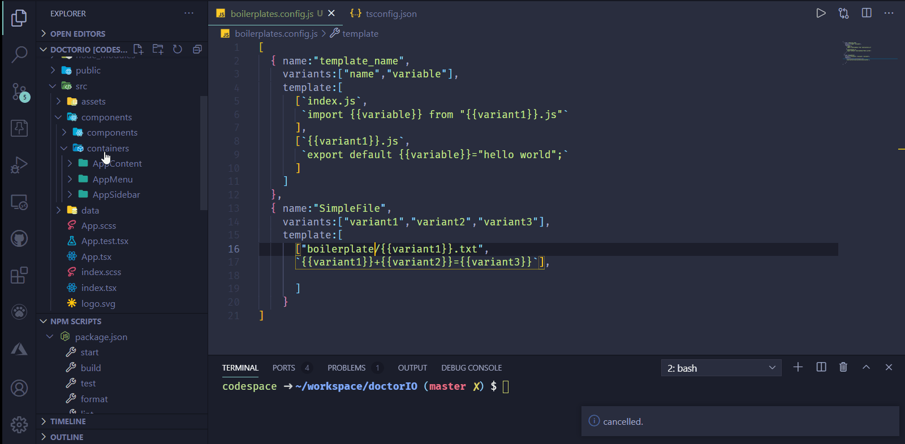
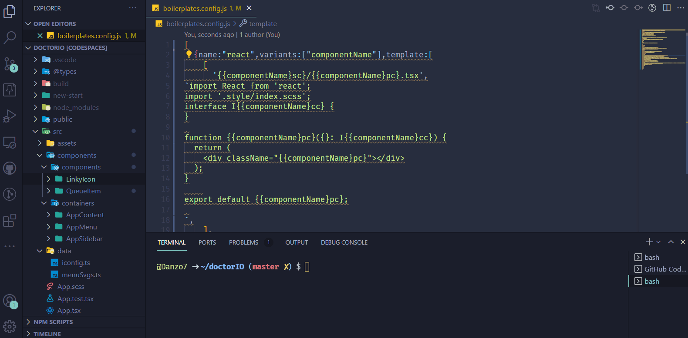

# Components boilerplate


    Components boilerplate is a Vscode Plugin to generate code pattern from a predefined configuration.
This plugin will increase the productivity and help maintain the same files structure across different developers/project.
## Guide of usage
Components boilerplates generates files/folders/code from a giving configuration file.
### Creating config file:
To be able to generate a well defined components you have to create a boilerplate config file with the necessary boilerplate code.
* A valid config file must be in your workspace project directory under the name of `boilerplates.config.js` in order for the plugin to work.
### config structure:
the config file contains `BoilerplateConfig[]`.
##### **Type definition:**
```ts
interface BoilerplateConfig {
  name: string;
  variants: string[];
  template:[string,string][];
}
```


| proprieties | definition |
| -----| ------ | 
|``name : string``|represent name of the boilerplate,in case you have more then on element in the config array you will be asked to select a boilerplate template by name|
|``variants : string[]``|array of string will be used later to fill the boilerplate code|
|``template:[path,content][]``|contain the path and content of the file that will be generated|

```js
[
  { name:"name",
    variants:[...],
    template:[
      [path,content],
      ...
      ]
    },
    ...
  ]
```

### How to use variants:
variants are a placeholders to variables,You have to provide a value for each variant when generating a component.
[Mustache.js](https://github.com/janl/mustache.js) is used to replace variants in template.
example: 


```js
[
  { name:"template_name",
    variants:["name","variable"],
    template:[
      [`index.js`,
       `import {{variable}} from "{{variant1}}.js"`
      ],
      [`{{variant1}}.js`,
       `export default {{variable}}="hello world";`
      ]
    ]
  },
  { name:"SimpleFile",
    variants:["variant1","variant2","variant3"],
    template:[
      ["boilerplate/{{variant1}}.txt",
      `{{variant1}}+{{variant2}}={{variant3}}`],
      
      ]
    }
]
```


### Plugin options:
|Option|Value|Definition
|------|------|-----|
|Wrapped|`Default:disabled`|When enabled first variant  will be used as a wrapper directory for the generated boilerplate


## Generate components:
- Right click on the intended folder
- click on `Generate new component...`
- Fill the necessary data.
- Done!
  

### example:
#### ***generate react typescript component :***
`Wrapped=enabled`



`boilerplates.config.js`:
```js
[{name:"react",variants:["componentName"],template:[
  [
    '{{componentName}}.tsx',
    `
  import React from 'react';
  import './index.scss';
  interface {{componentName}} {
  }
  
  function {{componentName}}({}: {{componentName}}) {
    return (
      <div className="{{componentName}}"></div>
    );
  }
  
  export default {{componentName}};
  
  `,
  ],
  [
    'index.ts',
    `
    import {{componentName}} from './{{componentName}}';
    export default {{componentName}};    
    `,
  ],
  [
    'index.scss',
    `.{{componentName}}{
    
  }`,
  ],
]
}];
```


## report issues and features
[create an issue](https://github.com/Danzo7/vscode-components-boilerplate/issues)
## Roadmap
- [x] add support for multiple custom boilerplates.
- [x] add support for custom variables (now only name).
